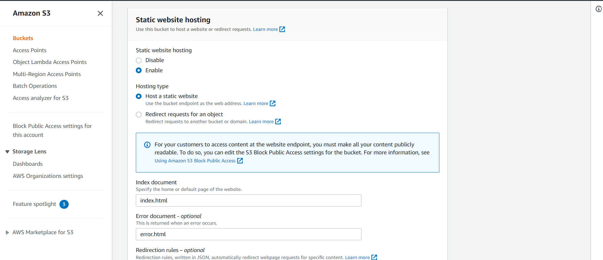
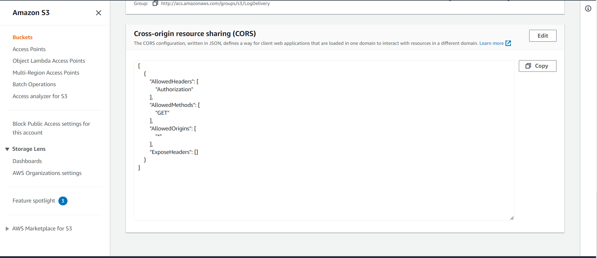
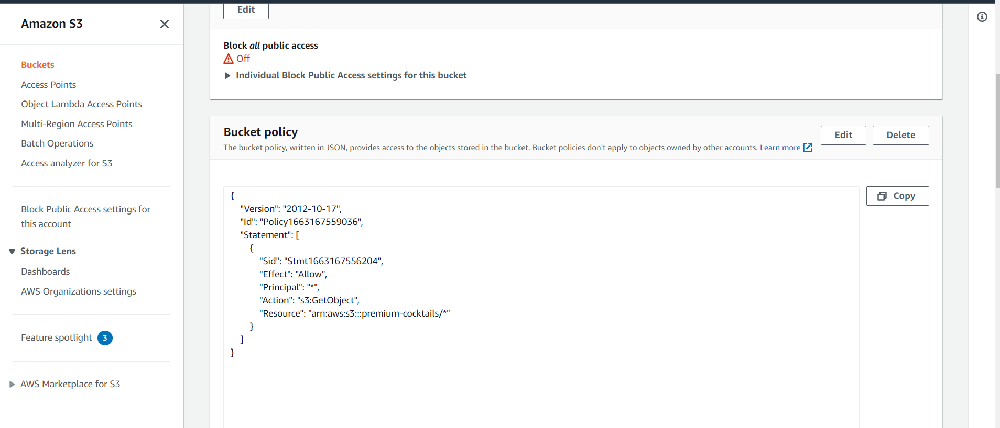
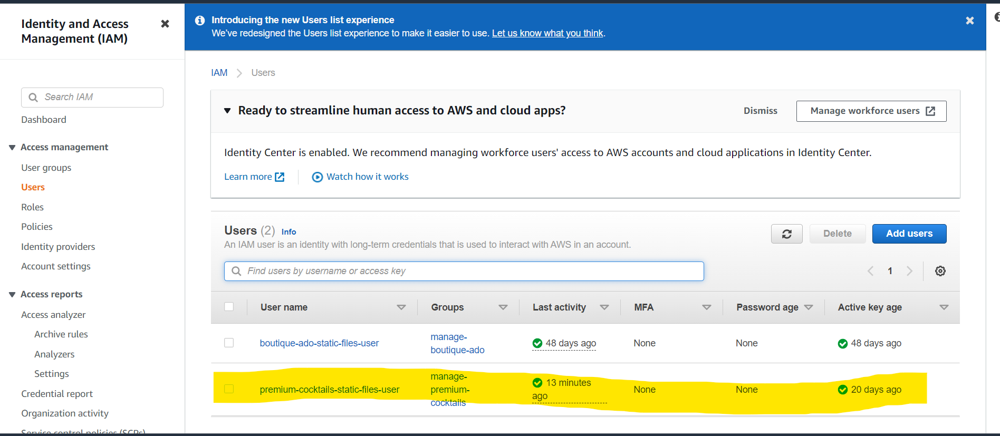
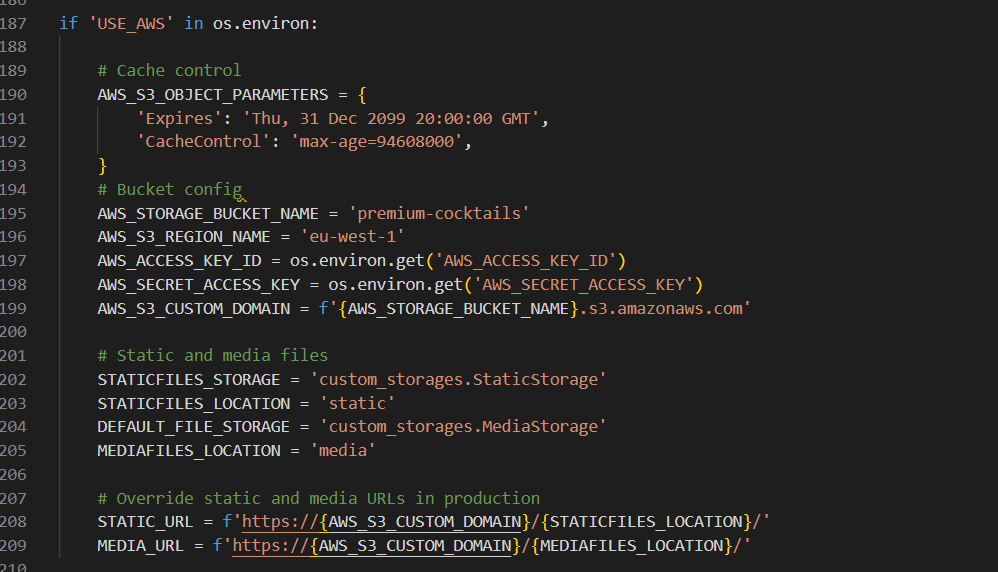
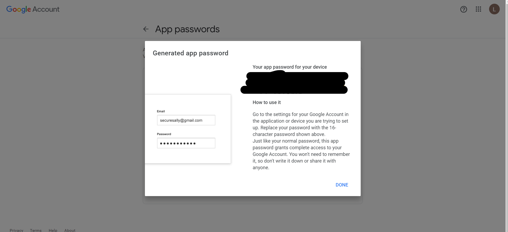

# Deployments

## Create Heroku App:
The below works on the assumption that you already have an account with [Heroku](https://id.heroku.com/login) and are already signed in.
1. Create a new Heroku app:
    * Click "New" in the top right-hand corner of the landing page, then click "Create new app."
2. Give the app a unique name:
    * Will form part of the URL 
3. Select the nearest location:
    * For me, this was Europe.
4. Add Database to the Heroku app:
    * Navigate to the Resources tab of the app dashboard. Under the heading "Add ons," search for "Heroku Postgres" and click on it when it appears. 
    * Select "Hobby Dev - Free" from the "plan name" drop-down menu and click "Submit Order Form."
5. From your editor, go to your projects settings.py file and copy the SECRET_KEY variable. Add this to the same name variable under the Heroku App's config vars.
    * left box under config vars (variable KEY) = SECRET_KEY
    * right box under config vars (variable VALUE) = Value copied from settings.py in project.

## Heroku Deploy
1. Install gunicorn, add it to the requirements.tx file using the command pip3 freeze > requirements.txt
2. From the CLI login to Heroku using the command heroku git:remote -a premium_cocktails
3. Disable collectstatic in Heroku before any code is pushed using the command heroku config:set DISABLE_COLLECTSTATIC=1 -a premium_cocktails
4. Push the code to Heroku using the command git push heroku master
5. Set environment variables in Heroku

6. Connect the app to GitHub and enable automatic deployment


7. Click deploy to deploy your application to Heroku for the first time
8. Click on the link provided to access the application


## Amazon WebServices
1. Create an account at aws.amazon.com
2. Open the S3 application and create an S3 bucket named "premium-cocktails"
3. Uncheck the "Block All Public access setting"
4. In the Properties section, navigate to the "Static Website Hosting" section and click edit
5. Enable the setting, and set the index.html and the error.html values
<br>

6. In the Permissions section, click edit on the CORS configuration and set the below configuration
<br>

7. In the permissions section, click edit on the bucket policy and generate and set the below configuration(or similar to your settings)
<br>

8. In the permissions section, click edit on the Access control list(ACL)
9. Set Read access for the Bucket ACL for Everyone(Public Access)
10. The bucket is created, the next step is to open the IAM application to set up access
11. Create a new user group named "	manage-premium-cocktails"
12. Add the "AmazonS3FullAccess" policy permission for the user group
13. Go to "Policies" and click "Create New Policy"
14. Click "Import Managed Policy" and select "AmazonS3FullAccess" > Click 'Import'.
15. In the JSON editor, update the policy "Resource" to the following
<br><code>"Resource": [</code>
<br><code>" "arn:aws:s3:::premium-cocktails",</code>
<br><code>" "arn:aws:s3:::premium-cocktails/*"</code>
<br><code>]</code>

16. Give the policy a name and click "Create Policy"
17. Add the newly created policy to the user group
<br>

18. Go to Users and create a new user
19. Add the user to the user group manage-scubasport
20. Select "Programmatic access" for the access type
21. Note the AWS_SECRET_ACCESS_KEY and AWS_ACCESS_KEY_ID variables, they are used in other parts of this README for local deployment and Heroku setup

22. The user is now created with the correct user group and policy
<br>

23. Note the AWS code in settings.py. Note an environment variable called USE_AWS must be set to use these settings, otherwise it will use local storage
<br>

24. These settings set up a cache policy, set the bucket name, and the environment variables AWS_ACCESS_KEY_ID and AWS_SECRET_ACCESS_KEY that you set in your aws account
25. The configuration also requires the media/static folders that must be setup in the AWS S3 bucket to store the media and static files 


## Google emails
To set up the project to send emails and to use a Google account as an SMTP server, the following steps are required
1. Create an email account at google.com, login, navigate to Settings in your gmail account and then click on Other Google Account Settings
2. Turn on 2-step verification and follow the steps to enable
3. Click on app passwords, select Other as the app and give the password a name, for example Django
<br>

4. Click create and a 16 digit password will be generated, note the password down
5. In the heroku variables, create an environment variable called EMAIL_HOST_PASS with the 16 digit password
6. In the heroku variables, create an environment variable called EMAIL_HOST_USER with the email address of the gmail account
7. Set and confirm the following values in the settings.py file to successfully send emails
<br><code>EMAIL_BACKEND = 'django.core.mail.backends.smtp.EmailBackend'</code>
<br><code>EMAIL_USE_TLS = True</code>
<br><code>EMAIL_PORT = 587</code>
<br><code>EMAIL_HOST = 'smtp.gmail.com'</code>
<br><code>EMAIL_HOST_USER = os.environ.get('EMAIL_HOST_USER')</code>
<br><code>EMAIL_HOST_PASSWORD = os.environ.get('EMAIL_HOST_PASS')</code>
<br><code>DEFAULT_FROM_EMAIL = os.environ.get('EMAIL_HOST_USER')</code>

8. You will also need to set the variables EMAIL_HOST_PASS and EMAIL_HOST_USER in your production instance, for example Heroku


## Local Deployment
To run this project locally, you will need to clone the repository
1. Login to GitHub (https://wwww.github.com)
2. Select the repository premium-cocktails-ci-pp5
3. Click the Code button and copy the HTTPS url, for example: https://github.com/NowickiLukasz/premium-cocktails-ci-pp5.git
4. In your IDE, open a terminal and run the git clone command, for example 

    ```git clone https://github.com/NowickiLukasz/premium-cocktails-ci-pp5.git```
5. The repository will now be cloned in your workspace
    6. Open the Gitpod Page, sign in to your account, go to settings and add variables that are below. 
<br>
"SECRET_KEY" = 'TO BE ADDED BY USER'
"STRIPE_PUBLIC_KEY" = 'TO BE ADDED BY USER'
"STRIPE_SECRET_KEY" = 'TO BE ADDED BY USER'
"STRIPE_WH_SECRET" = 'TO BE ADDED BY USER'
"AWS_ACCESS_KEY_ID" = 'TO BE ADDED BY USER'
"AWS_SECRET_ACCESS_KEY" = 'TO BE ADDED BY USER'
"EMAIL_HOST_USER" = 'TO BE ADDED BY USER'
"EMAIL_HOST_PASS" = 'TO BE ADDED BY USER'
"USE_AWS" = 'TO BE ADDED BY USER'
"DATABASE_URL" = 'TO BE ADDED BY USER'
"DEVELOPMENT"  = 'True'

6. Some values for the environment variables above are described in different sections of this readme
7. Install the relevant packages as per the requirements.txt file
8. In the settings.py ensure the connection is set to either the Heroku postgres database or the local sqllite database
9. Ensure debug is set to true in the settings.py file for local development
10. Add localhost/127.0.0.1 to the ALLOWED_HOSTS variable in settings.py
11. Run "python3 manage.py showmigrations" to check the status of the migrations
12. Run "python3 manage.py migrate" to migrate the database
13. Run "python3 manage.py createsuperuser" to create a super/admin user
14. Run manage.py loaddata db.json to load the product data into the database
15. Start the application by running <code>python3 manage.py runserver</code>
