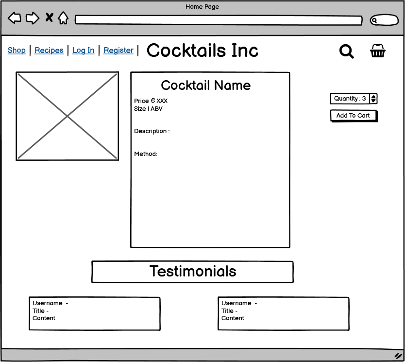

The purpose of this site is to allow user to be able to view a selection of pre-made cocktails, books and recipes. The user, if they so choose, may have a choice of products to purchase via the on site payment portal.
If the user wishes, they may create an account, which will allow the user to view past purchases or leave a review on any of the products or recipes. 

## Live Link 
This is the [live link]() for the site - need to isert link

# Table of Contents
- [User Experirence(UX)](#user-experience-ux)
    - [User Stories](#user-stories)
    - Site Owner
- Site Structure
- Database Models
- WireFrames
- Site features
- Techonologies Used
- Deployment
- Credits

# User Experience (UX)
## User Stories
- As a new user 
    - I want to easily navigate throughout the site.
    - I want to understand the purpose of the site easily so that I can see what is offers me.
    - I want a clear layout of the site so that i can navigate easily.
    - I want the site to be responsive across all devices.

- As an unregistered user:

    - I want to be able to search and filter products easily and efficiently.
    - I want to be able to sort and view products according by price and name.
    - I want to be able to be able to view product detail so I can find information about priceand description.
    - I want to be able to complete the checkout process and be able to enter payment information easily.
    - I want to be able to view a confirmation of my order once the checkout process is complete.
    - I want to be able to received an email confirmation of my order. -- mebe
    - I want to be able to read reviews from previous users of the product.
    - I want to be able to register easily for an account.
    - I want to be able to add products to my shopping basket.
    - I want to be able to view my shopping basket.
    - I want to be able to edit my shopping basket.
    - I want to be able to remove items from my shopping basket.
    - I want to be able to view the total amount of my basket.
    - I want to be able to see instructions appear to notify me if I have succeeded in purchasing a product etc.
    - I want to be able to send a message to the company if I have any queries
    - I want to be able to sign up to a news letter from the company to be able to receive updates on products.
    
- As a registered user:

    - I want to be able to receive a confirmation email upon registration.
    - I want to be able to access my account.
    - I want to be able to edit information on my account.
    - I want to be able to view my order history.
    - I want to be able to login and logout.
    - I want to be able to leave, edit and delete reviews on products.
    - I want to be able to see instructions appear to notify me if I have succeeded in posting a comment or review etc.
    - I want to be able to add products to my shopping basket.
    - I want to be able to view my shopping basket.
    - I want to be able to edit my shopping basket.
    - I want to be able to remove items from my shopping basket.

- As a reccurign user:

    - I want to be able to find social media links.
    - I want to be able to contact the site owner.

- As a site owner:

    - I want to be able to add new products.
    - I want to be able to edit or delete products.
    - I want to be able to edit or delete recipes.
    - I want to be able to access the Django admin portal easily

# Site Structure
This project has been designed with multiple applications for the ease of manipulation of data and a logical approach to building the site with the Django framework. 

- Home
    - This app contains the information needed to allow the user to easliy browse through the site. 

- Products
    - This app contains all of the products that are sold on the site. The user may view each product, add a product to the basket and search for items ont the pages. 
    Each item on the page may be selected and the details of the item will be displayed, alongside any reviews that may have been left by previous buyers or previous consumers.
- Recipes 
    - This app allows the users to view a listing of recipes of popular mixed drinks. Once a recipe has been selected, it will display the recipe method and the ingredients needed to create the drink.

- Checkout
    - This app allows the user to purchase items they have selected. They may adjust the items quantity or remove entitrely if required. 

- Basket 
    - This app allows the user to view the selected items though their shopping experience.

- Profiles
    - This app allows the user to save their details so that the checkout app may prepoulate a shipping details form so that they may purchase products quicker. 

- Shop
    - This app allows the user to select a page they with to head to. They may choose to eaither go to pages they may purchase goods from or to view repices

- Contact form
    - This app allows the users to send a message to the site owner to let them know how they view their goods and what can be imporved with new products.

# Database Models
This is a database schema on the connection of the database models. 

# Wireframes

### Home Page

 

### Shop Page

 

### Cocktail List Page

 

### Book List Page

 

### Cocktail Details Page

 

### Book Details Page

 

### Basket

 

### Checkout

 

### Profile

 

# Site Features

## Navigation

The navigation section of the pages contains a logo, a search bar, link to view profile for regular user and additional fields for site admin and a basket button. 

The footer allows the user the contact the site owner or to signup to a site newsletter.

img of account button for user and admin

img of footer

## Products Pages

The initial page a user will view will be to allows them to select a category of product to view or recipes. 

Img of shop page. 

The user may select one of these and browse through items on the page. 

Items that may be purchased have a a sort function. 

img of sort function 

Site admin may edit or delete unwanted items on the site. 

img of edit-delete in products page

## product details 

img of product details

On this page a user may select a quantity of items they wish to purchase and add the items to the basket 

img of select quantity and add basket 

## Register/ Log-in / Log-out

Here the a user may register for the site or if tghe user has an account they may login or out of the the site. 

Images of site log in or out

## Profile

Here the current logged in user may view their details and view their previous purchase history 

img profile page

## Basket Page

A user of the site that has added items to the basket may adjust the items they have selected. 

They may remove all items if necessary

The user may then proceed to the checkout page to finalise their purchase. 

images of adjust items and checkout button 

## Checkout

A user may enter their delivery details on the form provided or if they have an account registered, the details will be filled out.

The user must fill out a card detail form which, once filled out will permit the user to purchase the items selcted

img checkout

## Confirmation 

A user will be taken to the confirmation page once the purchase has been made. 

img confirmation

## Contact Us

The user will be able to fill out a form with their details and a message to the site owner. 

img contact us

### bugs through work 
1. 
Images would not load. 
- found that i needed to have an if statement to load images if there was no image loaded for a certain item the page qould crash

2. Needs to be fixed 
- header section is very tall

3. Sorting function would not work throught te development. 
- Had to place the category into the products view rather than the shop one

4. overlay bug-  checkout 
-  stop workspace and refresh page 