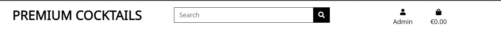

The purpose of this site is to allow user to be able to view a selection of pre-made cocktails, books and recipes. The user, if they so choose, may have a choice of products to purchase via the on site payment portal.
If the user wishes, they may create an account, which will allow the user to view past purchases or leave a review on any of the products or recipes. 
The Site Consists of 2 main sections. 
First section is the purchasable products, books or bottled drinks. 
Second section is the recipes. The recipes for the scope of this project will be classic 3 ingredient drinks. 

## Live Link 
This is the [live link](https://premium-cocktails.herokuapp.com/) for the site

# Table of Contents
- [User Experirence(UX)](#user-experience-ux)
    - [User Stories](#user-stories)
    - [Site Owner](#site-owner)
- [Site Structure](#site-structure)
- [Database Models](#database-models)
- [WireFrames](#wireframes)
- [Site features](#site-features)
- [Business Model](#business-model)
- [SEO](#seo)
- [Marketing](#marketing)
- [Techonologies Used](#techonologies-used)
- [Future Features](#future-features)
- [Testing](#testing)
- [Deployment](#deployment)
- [Credits](#credits)

# User Experience (UX)
## User Stories
- As a new user 
    - I want to easily navigate throughout the site.
    - I want to understand the purpose of the site easily so that I can see what is offers me.
    - I want a clear layout of the site so that i can navigate easily.
    - I want the site to be responsive across all devices.

- As an unregistered user:

    - I want to be able to search and filter products easily and efficiently.
    - I want to be able to sort and view products according by price and name.
    - I want to be able to be able to view product detail so I can find information about priceand description.
    - I want to be able to complete the checkout process and be able to enter payment information easily.
    - I want to be able to view a confirmation of my order once the checkout process is complete.
    - I want to be able to received an email confirmation of my order.
    - I want to be able to read reviews from previous users of the product.
    - I want to be able to register easily for an account.
    - I want to be able to add products to my shopping basket.
    - I want to be able to view my shopping basket.
    - I want to be able to edit my shopping basket.
    - I want to be able to remove items from my shopping basket.
    - I want to be able to view the total amount of my basket.
    - I want to be able to see instructions appear to notify me if I have succeeded in purchasing a product etc.
    - I want to be able to send a message to the company if I have any queries
    - I want to be able to sign up to a news letter from the company to be able to receive updates on products.
    
- As a registered user:

    - I want to be able to receive a confirmation email upon registration.
    - I want to be able to access my account.
    - I want to be able to edit information on my account.
    - I want to be able to view my order history.
    - I want to be able to login and logout.
    - I want to be able to leave, edit and delete reviews on products.
    - I want to be able to see instructions appear to notify me if I have succeeded in posting a comment or review etc.
    - I want to be able to add products to my shopping basket.
    - I want to be able to view my shopping basket.
    - I want to be able to edit my shopping basket.
    - I want to be able to remove items from my shopping basket.

- As a reccurign user:

    - I want to be able to find social media links.
    - I want to be able to contact the site owner.

## Site Owner
- As a site owner:

    - I want to be able to add new products.
    - I want to be able to edit or delete products.
    - I want to be able to edit or delete recipes.
    - I want to be able to access the Django admin portal easily

# Site Structure
This project has been designed with multiple applications for the ease of manipulation of data and a logical approach to building the site with the Django framework. 

- Home
    - This app contains the information needed to allow the user to easliy browse through the site. 

- Products
    - This app contains all of the products that are sold on the site. The user may view each product, add a product to the basket and search for items ont the pages. 
    Each item on the page may be selected and the details of the item will be displayed, alongside any reviews that may have been left by previous buyers or previous consumers.
- Recipes 
    - This app allows the users to view a listing of recipes of popular mixed drinks. Once a recipe has been selected, it will display the recipe method and the ingredients needed to create the drink.

- Checkout
    - This app allows the user to purchase items they have selected. They may adjust the items quantity or remove entitrely if required. 

- Basket 
    - This app allows the user to view the selected items though their shopping experience.

- Profiles
    - This app allows the user to save their details so that the checkout app may prepoulate a shipping details form so that they may purchase products quicker. 

- Shop
    - This app allows the user to select a page they with to head to. They may choose to eaither go to pages they may purchase goods from or to view repices

- Contact form
    - This app allows the users to send a message to the site owner to let them know how they view their goods and what can be imporved with new products.

# Database Models
This is a database schema on the connection of the database models. 

# Wireframes

### Home Page

 

### Shop Page

 

### Cocktail List Page

 

### Book List Page

 

### Cocktail Details Page

 

### Book Details Page

 

### Basket

 

### Checkout

 

### Profile

 

# Site Features

## Navigation

The navigation section of the pages contains a logo, a search bar, link to view profile for regular user and additional fields for site admin and a basket button. 

The footer allows the user the contact the site owner or to signup to a site newsletter.

## Products Pages

The initial page a user will view will be to allows them to select a category of product to view or recipes. 

The user may select one of these and browse through items on the page. 

Items that may be purchased have a a sort function. 

Site admin may edit or delete unwanted items on the site. 

## product details 

On this page a user may select a quantity of items they wish to purchase and add the items to the basket 

## Register/ Log-in / Log-out

Here the a user may register for the site or if the user has an account they may login or out of the the site. 

## Review Page

A user is required to have an account set up and be logged in, in order to leave a review on a product that can be purchased.

## Profile

Here the current logged in user may view their details and view their previous purchase history 

## Basket Page

A user of the site that has added items to the basket may adjust the items they have selected. 

They may remove all items if necessary

The user may then proceed to the checkout page to finalise their purchase. 

## Checkout

A user may enter their delivery details on the form provided or if they have an account registered, the details will be filled out.

The user must fill out a card detail form which, once filled out will permit the user to purchase the items selcted

## Confirmation 

A user will be taken to the confirmation page once the purchase has been made. 

## Contact Us

The user will be able to fill out a form with their details and a message to the site owner. 

# Business Model

This project is designed for the use of cocktail enthusiasts where they can buy drinks, study material and view recipes. 
The business model is a Business to Customer(B2C). The market this project aims to attact to is those of 25 and over, as this age group has disposable income and are willing to spend more money on higher quality products and those specialised in the field may come tot he site to do research in the future.  

# SEO
To imporve the SEO for search engines, keywords and description was user in the HTML meta head section. 
The images have related names to what users would search for while looking for drinks. One such name is "porn-star-martini", which is one of the most cocktails in the world. 

# Marketing
## Facebook Page
To allow the span of the business to be broader than just a website, there will be a dedicated Facebook page. 

A broad layout of the viable site is vivible in the below image. 

 

# Testing
All of the manual testing can be found in the [TESTING](TESTING.md) file 

# Techonologies Used
## Dependencies
- asgiref==3.5.2
- backports.zoneinfo==0.2.1
- boto3==1.24.72
- botocore==1.27.72
- dj-database-url==0.5.0
- Django==3.2
- django-allauth==0.41.0
- django-countries==7.3.2
- django-crispy-forms==1.14.0
- django-storages==1.13.1
- gunicorn==20.1.0
- jmespath==1.0.1
- oauthlib==3.2.0
- pathspec==0.10.1
- Pillow==9.2.0
- psycopg2-binary==2.9.3
- python3-openid==3.2.0
- pytz==2022.2.1
- requests-oauthlib==1.3.1
- s3transfer==0.6.0
- sqlparse==0.4.2
- stripe==4.1.0

## Technologies
- [Django](https://www.djangoproject.com/) - Project Framework
- [Heroku](https://id.heroku.com/login) - Deployed site server
- [Bootstrap 4](https://getbootstrap.com/docs/4.6/getting-started/introduction/) - Styling for the site
- [Git Hub](https://github.com/) - Repository for storing code
- [Git](https://git-scm.com/) - An open source distributed version control system
- [Git Pod](https://gitpod.io/) - An IDE for code creation
- [HTML Validator](https://validator.w3.org/) - Used for validating HTML code
- [CSS Validator](https://jigsaw.w3.org/css-validator/) - Used for validating CSS code
- [JSHint](https://jshint.com/) - Used for validating JavaScript code
- [AWS](https://aws.amazon.com/) - For static file hosting
- [Balsamiq](https://balsamiq.com/) - For drawing wireframes for the project
- [FontAwesome](https://fontawesome.com/v5/docs/) - For icons on the website

## Languages
- [HTML5](https://en.wikipedia.org/wiki/HTML5) - Markup language for content creation
- [CSS3](https://en.wikipedia.org/wiki/CSS) - Styling language
- [JavaScript](https://en.wikipedia.org/wiki/JavaScript) - For dynamic features on the site
- [Python3](https://www.python.org/) - Used to provide logic to the project

# Future Features
- Ability to ask the user to be age verified at the entry to the site as of the sales of alcohol. 
- Ability for the site owner to reply derectly to contact us forms from the site
- Ability to send mass emails to all newsletter subscriber
- Allow for dynamic addition of extra ingredients in the recipe 
- Allow for a search feature for ingredient names in a drop down format

# Bugs
1. Images would not load. 
- I found that i needed to have an if statement to load images if there was no image loaded for a certain item the page would crash

3. Sorting function would not work throught te development. 
- Had to place the category into the products view rather than the shop view

4. Heroku database updates
- Through this project heroku updated the database urls. This caused the project to shut down twice.
The solution was to go to heroku, copy the new database url and replace it in the gitpod variables.

# Deployment

The deployment steps and actions required in order to start this project up can be found in the [Deployment](DEPLOYMENT.md) file attatched here. 

# Credits

- Cocktail images - https://www.punch.com
- Cocktail books - https://www.cocktailkingdon.com
- Cocktail bottles  - https://www.cosmopolitan.com/uk/worklife/g37664570/best-bottled-cocktails/
- Review template - Inspiration from django blog CI project
- [Readme deployment layout ](https://github.com/dannymagnus/CI_MS5_Ecomm/blob/main/README.md)
