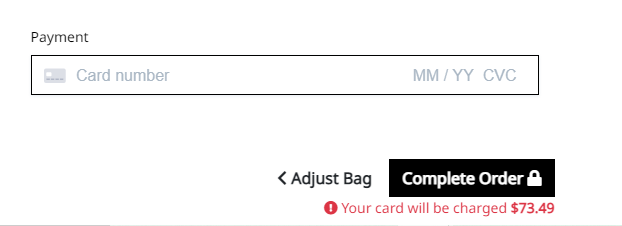

The results for testing are shown below.

# Table of Content

## Validation
- HTML

- CSS

- Python

- JavaScript

- LightHouse

## Testing User Stories
- General
    - As a user I want to be able to uderstand that the page is for, once the home page loads. 
    <!-- Home page image -->
    

    - As a user, once i visit the shop page, I can view what categories are there. 
    <!-- Shop main imd -->
    

    - As a user I can search for selling items, view the basket or head to the home page.
    <!-- Navigation -->
    

    - As a User I want to be able to sign up to a newsletter
    <!-- Newsletter footer -->
    

- Basket
    - As a user I want to be able to view the items added to the basket. 
    <!-- Basket items -->
    

    - As a user I want to be able to view the total price of the items that i am about to purchase.
    <!-- Total items price -->
    

    - As a user, I want to be able to view the basket items once an item has been added to the basket.
    <!-- Basket drop down -->
    

    - As a user I want to be able to adjust item quantity before i commit to buying. 
    <!-- Adjust message and page -->
    

- Checkout
    - As a User i want to be able to view my billing details in the chekout page. 
    <!-- checkout page details -->
    

    - As a user I want to be able to view the total of the items i am about to purchase. 
    <!-- Totla purchase items -->
    

    - As a user I want to be able to give my card details to the site so that my account can be charged. 
    <!-- Card details -->
    

    - As a User I want to be able to view a confirmation details page once my purchase is completed. 
    <!-- Confirmatio page -->
    

- Contact Form
    - As a User i want to be let known if my form has not been filled out correctly. 
    <!-- Validation  -->
    

    - AS a user I want to be shown a message once my form has been sent to the site owner. 
    <!-- Message once the form is sent -->
    

    - As an Admin, I want to be able to view the submitions from the users
    <!-- Admin view contact-us -->
    

- Products
    - As a User I want to be able to view the books and drinks pages. 
    <!-- show books and drinks page -->
    

    - As a user i want to be able to add a quantity of a selected product to the basket.
    <!-- show the add to basket buttona dn quantity selector -->
    

    - As a user I want to be notified of the items that i ahev just added to the basket. 
    <!-- Add Basket notification  -->
    

- Profile
    - As a user i want to be able to view previous purchases if i have an account.
    <!-- Display previous purchases -->
    

    - As a user I want my details to be filled out if I have an account on the site. 
    <!-- Details filled out -->
    

- Recipe
    As the site owner i want to be able to add a recipe to the site 
    <!-- recipe add page -->
    

    - As a site owner i want to be able to add ingredients to the recipe that has been created.

    - As the site owner i want to be able to edit a recipe on the site 
    <!-- recipe edit page -->
    

    - As the site owner i want to be able to remove a recipe from the site 
    <!-- recipe remove page -->
    

## Manual Testing

### Navigation

### Footer

### Home Page

### Register

### Log-in

### Products 

#### Shop Page

#### Products Page

#### Product Details Page

#### Product Reviews

#### Basket Page

#### Checkout Page

#### Profile Page

#### Shop Management

### Contact Us

### Newsletter

